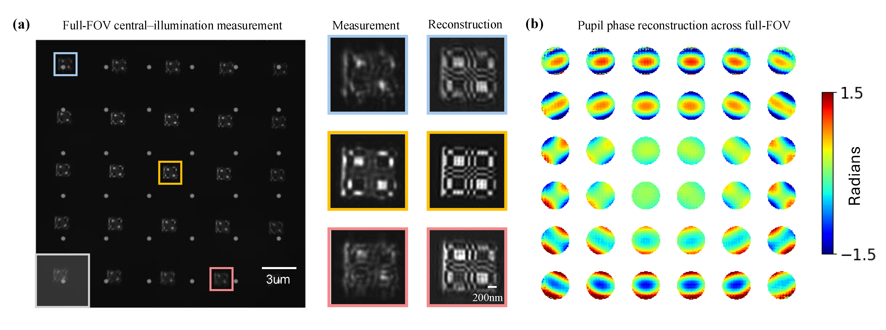

# EUV_FPM
**Enhanced EUV Mask Imaging Using Fourier Ptychographic Microscopy**  

Presented at *SPIE Optical and EUV Nanolithography XXXVIII*, February 26, 2025. 

Preprint manuscript and example datasets are available upon reasonable request. 
Contact: chaoying_gu@berkeley.edu

## **Basic Usage**  

### **Single-Patch FP Reconstruction**  
Run `recon.py` with a selected configuration file from `configs/recon/`:  

1. Choose a configuration file in `configs/recon/`.  
2. Set the `config_name` parameter in `recon.py` to the target configuration file name.  

### **Full-FOV FP Reconstruction (with Automatic Patch Division)**
Run `recon_full.py` for a full-FOV reconstruction using automatically divided patches:

1. Choose a configuration file in `configs/recon_full/`.
2. Set the `config_name` parameter in `recon_full.py` to the target configuration file name.

## Reconstruction visualization and refinement
Check the `plot_exp.ipynb` and   `torch_fp_recon.ipynb` and choose the configuration file accordingly.

## **Configuration File Key Fields**  

Below are a few key parameters in the configuration files:  

- **`elliptical_pupil`**:  
  - Set to `True` for anamorphic 0.55/4× NA with 20% central obscuration and 1250× magnification.  
  - Set to `False` for isomorphic 0.33/4× NA with 900× magnification.  

- **`ROI_length`**:  
  - Defines the reconstruction patch size.  

- **`algorithm`**:  
  - Specifies the reconstruction algorithm. Choose from:  
    - `'GS'` – Gerchberg-Saxton 
    - `'GN'` – Gauss-Newton 
    - `'EPFR'` – Embedded Pupil Function Recovery
  

## Full-FOV Reconstruction Demo
Data collected at 13.5 nm wavelength EUV microscope.  

(a) Details of three sample regions in the full FOV, showing one raw captured image and the corresponding reconstruction for each. The gray box in the bottom left corner marks the patch used for field-dependent aberration analysis in panel (b). The gray dots indicate the centers of the segmented regions, with the full FOV divided into a 6×6 grid with 20% overlap.  
(b) Full-FOV aberration visualization, where the 6×6 grid layout presents the pupil wavefront reconstruction for each patch.

